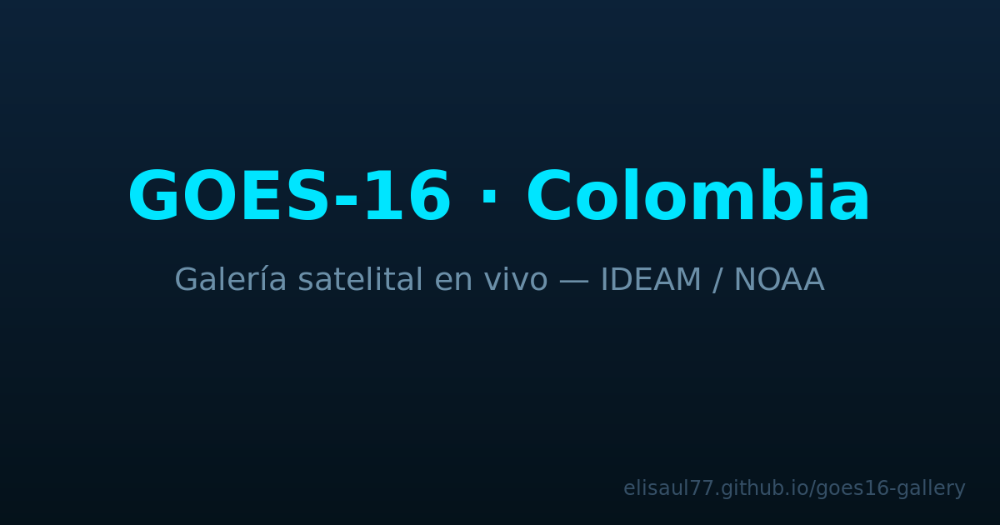
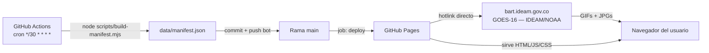

# GOES-16 · Colombia — Galería Satelital

[](https://github.com/elisaul77/goes16-gallery/actions/workflows/update-gallery.yml)
[](https://elisaul77.github.io/goes16-gallery/)
[](LICENSE)



## Demo en vivo

### [https://elisaul77.github.io/goes16-gallery/](https://elisaul77.github.io/goes16-gallery/)

Galería web estática de imágenes satelitales GOES-16 sobre Colombia, actualizada automáticamente cada 30 minutos desde los servidores públicos del IDEAM / NOAA. Sin dependencias externas, sin servidor backend.

---

## Características

- **Hero GIF animado** — 23 regiones × 3 canales (Visual C02, Infrarrojo C13, Vapor de agua C08) con selector de región y cambio de canal
- **Galería JPG** — 16 canales (C01–C16) + 9 productos derivados (AIR_MASS, ASH, TRUE_COLOR, WATER_VAPOR, etc.) con lazy loading agresivo, skeleton loaders y lightbox accesible
- **Time-lapse interactivo** — Reproducción fluida con control de velocidad (0.5×–4×), navegación frame a frame y modo bucle; hasta 48 fotogramas por producto
- **Dark theme espacial** — Grid responsive, transiciones suaves, campo de estrellas generativo
- **Accesibilidad** — ARIA completo, navegación 100% por teclado, skip-link, `prefers-reduced-motion`, contraste AA en todos los textos
- **Cero dependencias** — HTML + CSS custom properties + ES Modules; sin frameworks, sin bundlers

---

## Arquitectura



El scraper (`scripts/build-manifest.mjs`) solicita los listados de directorio HTTP del servidor de IDEAM, extrae los timestamps de los archivos `.jpg` y genera `data/manifest.json` con hasta 48 frames por producto. Las imágenes **nunca se almacenan en el repositorio** — se hotlinkean directamente desde los servidores de IDEAM.

---

## Stack

| Capa        | Tecnología                                        |
|-------------|---------------------------------------------------|
| Frontend    | HTML5 + CSS3 (custom properties) + ES Modules     |
| Datos       | `data/manifest.json` generado en CI               |
| Scraper     | Node.js 20, stdlib únicamente (sin dependencias)  |
| CI/CD       | GitHub Actions (cron 30 min + push + dispatch)    |
| Hosting     | GitHub Pages (artefacto estático)                 |

---

## Desarrollo local

```bash
git clone https://github.com/elisaul77/goes16-gallery.git
cd goes16-gallery

# Generar manifest con datos reales de IDEAM (requiere red)
node scripts/build-manifest.mjs

# O usar datos de prueba sin peticiones de red
node scripts/build-manifest.mjs --fixture

# Servidor local
python3 -m http.server 8080
# Abrir http://localhost:8080
```

Los datos de prueba (fixture) están en `scripts/__fixtures__/listing.html` y permiten desarrollar la UI sin depender de la disponibilidad del servidor de IDEAM.

---

## Atribución

> **Imágenes:** [IDEAM](https://www.ideam.gov.co) (Instituto de Hidrología, Meteorología y Estudios Ambientales — Colombia), satélite [GOES-16](https://www.goes-r.gov/) (NOAA / NASA).
>
> Uso exclusivamente informativo y educativo. Las imágenes son de dominio público proveídas por el IDEAM. Este proyecto es un visor web no oficial.

---

## Licencia

[MIT](LICENSE) — código fuente libre.
Las imágenes satelitales están sujetas a los términos de uso del IDEAM y NOAA.
